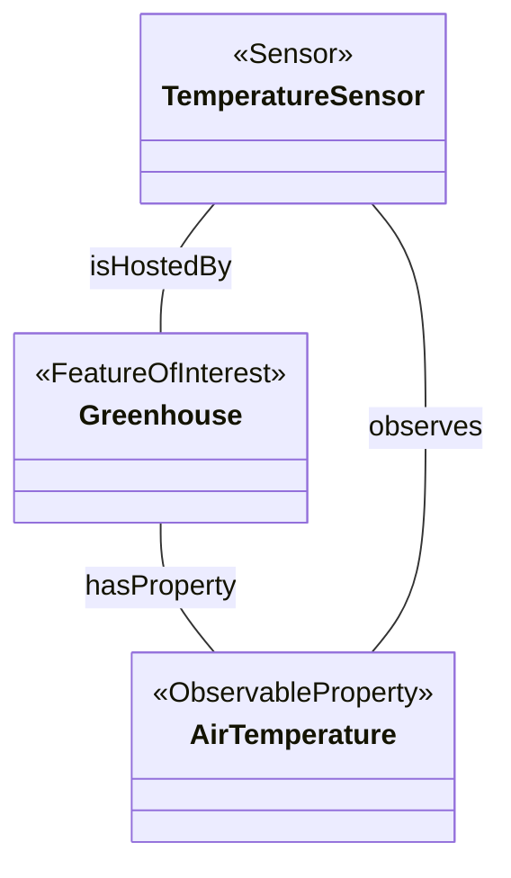

# Semantic IoT Search (SSN/SOSA & OpenHAB)

Цей проєкт реалізує інтелектуальну систему пошуку IoT-пристроїв на основі семантичних метаданих та онтології **SSN/SOSA**. Система здатна знаходити пристрої не за назвою, а за їхніми функціональними можливостями (Capabilities).

## 1. Ontology Diagram (Mermaid)
Ця діаграма відображає семантичні зв'язки між компонентами системи згідно з онтологією SSN/SOSA.



## 2. Query Language Specification
Система використовує спрощену мову запитів на основі природних категорій (Natural Language Mapping):

Префікс: Search: — ініціалізує семантичний розбір.

Ключові слова: Temperature, Humidity, Ventilation, Actuators.

Обробка: Двигун ігнорує регістр та видаляє службові слова для пошуку точного збігу в метаданих.

## 3. Search Algorithm Description
Алгоритм реалізований як Reasoning Engine на JavaScript (GraalVM):

Trigger: Спрацьовує при оновленні стану Search_Query.

Filtering: Відсікає некоректні або порожні запити (NULL/UNDEF).

Scan: Проходить циклом по всіх зареєстрованих Items у системі.

Matching: Порівнює нормалізований запит із трьома полями: метадані ssn_sosa, теги (Tags) та мітка (Label).

Output: Формує список знайдених пристроїв та оновлює Search_Results.

## 4. Usage Examples
Запит: Search: Temperature Sensors -> Результат: Found: Air Temperature.

Запит: Search: All Actuators -> Результат: Found: Ventilation Fan.

## 5. Configuration & Metadata Schemas
Semantic Item Definitions (.items)
Приклад опису сенсора з семантичними анотаціями:
Number Greenhouse_Temp "Air Temperature" ["Measurement", "Temperature"] { ssn_sosa="Sensor", property="Temperature" }
Metadata Schemas
Система використовує кастомний простір імен метаданих для підтримки семантичного розбору:

Namespace: ssn_sosa.

Values: Sensor, Actuator, Ventilation, Temperature.

Query Processing (JS Engine)
Логіка обробки запиту у файлі semantic_search.js:
```
const query = queryItem.state.toString().toLowerCase().replace("search:", "").trim();
const ssnMeta = item.getMetadata("ssn_sosa");
if (ssnMeta && ssnMeta.value.toLowerCase().includes(query)) { 
    found.push(item.label); 
}
```